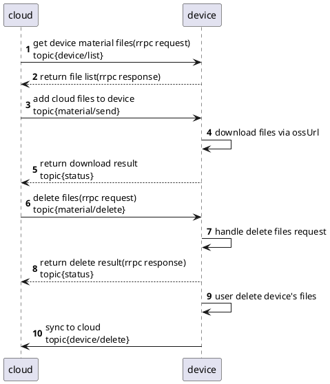
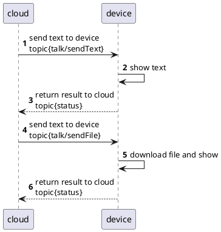
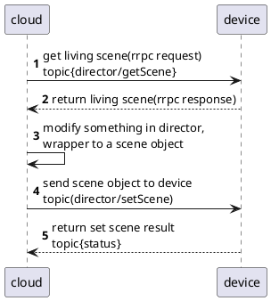
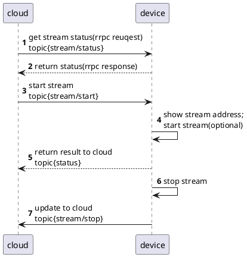
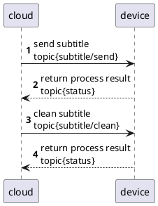
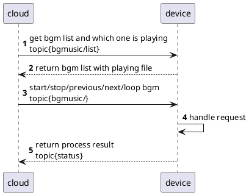
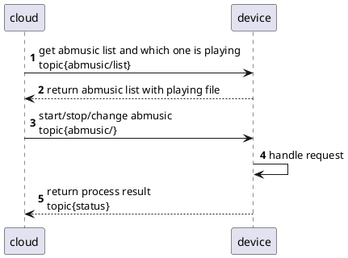
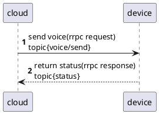

## 1. 素材管理


### 1.1 云端删除素材
```plantuml
autonumber
cloud -> device : delete materials by fileIds
device -> database : query file paths
database --> device : return file paths
device -> datastore : delete files by file paths
datastore --> device : delete result
device -> database : delete file record
device --> cloud : return status
```

## 2. 设备对话


## 3. 导播


## 4. 推流


## 5. 直播弹幕

## 6. 背景音乐



## 7. 氛围音

## 8. 远程喊麦

## 9. 远程提词
