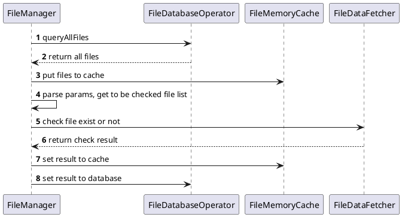

# 文件是否存在
## 时序图

## 盘符信息
不外接任何存储设备，player AC起来收到两个盘符的消息：
`/iva/preset` -- VOLUME_TYPE_PRESET，预置素材，因版本升级可能有变，因此每次开机都会检查是否存在
`/storage/emulated/0` -- VOLUME_TYPE_VIRTUAL_SD，虚拟SD卡，本地素材存储在这里，因只有ui改动，因此无需判断是否存在
VOLUME_TYPE_SD、VOLUME_TYPE_USB -- 外置存储，每次开机都要主动检查是否存在

## Volume
```java
Volume{path='/iva/preset', name='Preset', availableBytes=0, totalBytes=0, volumeType=1}
Volume{path='/storage/emulated/0', name='Internal', availableBytes=0, totalBytes=0, volumeType=2}
```


## 关键改动
1. 在DataCache中增加文件二级缓存，并且使`scene缓存`中的file引用该内存，这样可以确保更新file cache后，scene缓存可以拿到最新的数据。
2. 在对文件信息进行修改后，会主动触发ContentResolver的notifyChange，确保player和camera可以更新数据
3. player不再监听source size change的回调，改为在UI层更改文件时判断resolution是否为空，为空时则获取并更新至数据库
4. 把`FileTable`删除，数据层和UI层共用`File`
5. 将scene change和file change的回调分开
6. ui/presenter层禁止持有缓存的scene对象
## 相关修改
[16759](http://intellyva:81/c/intellyva/apks/liveplayer/+/16759)